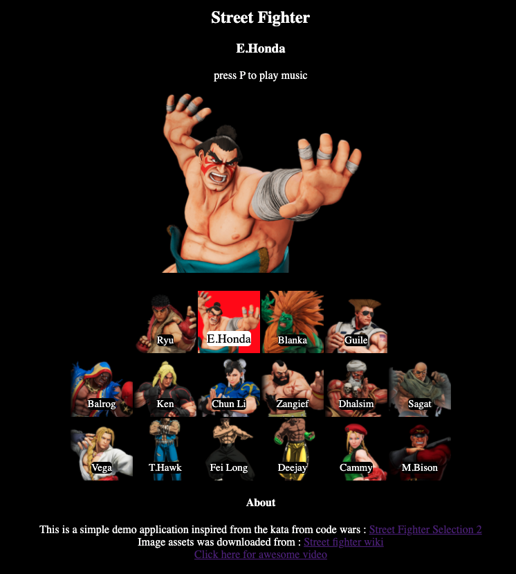

# street-fighter-selection-cljs

Simple street fighter character screen inspired by similar code wars kata : [code-wars](https://www.codewars.com/kata/58583922c1d5b415b00000ff)   

The assets are downloaded from the [street fighter wiki pages](https://streetfighter.fandom.com/wiki/Street_Fighter_Wiki)  

Check the site on [here](https://sabin-gurung.github.io/sft-character-select/)

## Overview

Personal project to learn clojurescript, reagent and core async.

## License

Copyright © 2018 FIXME

Distributed under the Eclipse Public License either version 1.0 or (at your option) any later version.
